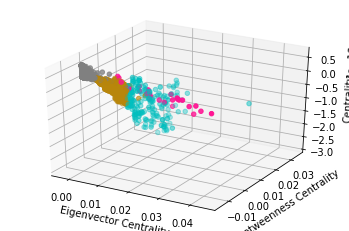
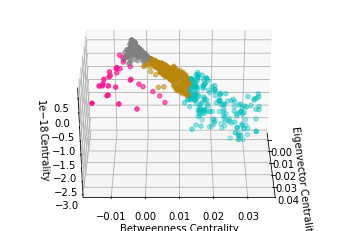
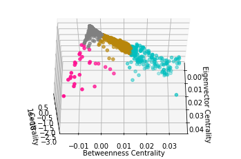

# Creating IP-based Profiles for Document Recommendation on EDGAR

### Project Description & Motivation

EDGAR log file set has a wealth of information about (masked) IP addresses and which documents the ip address attempted to access. This project aims to create a log of similar documents like a Page Rank based upon the IP paths over the course of a day. 

The applicability of the model could serve investigators looking into possible networks amongst anonymous IP addresses. It could also possibly detect latent social networks or grouped similar behavior. 

### Background

EDGAR is the Securities and Exchange Commission's database for accessing publicly available financial & ownership information about publicly traded companies. Millions of people across the world access the database, including crawlers from large institutions like Bloomberg and smaller investors.

### Github Structure
* data: contains the sample log data and one original training file.
* worksheet: contains the Jupyter Notebooks.
* scripts: contains the scripts used in ETL.
* img: will contain the graph images to be used on the README.

### Exploratory Data Analysis

#### Assumptions

1. All events are independent; each event represents a unique identifiable sequence per IP address.
2. Crawlers used are represented in the higher range of document acquisition.
3. Smaller financial researchers can be represented by the range of document hits 30 - 200 and with ip hits in the range of 30 - 200. 

**Issues**
* Because of masking and/or single ips mapping to multiple individuals, creating truly unique paths is not possible at this time. 
* The size of the data also made ingestion difficult, limited by the memory on the EC2 instance. A work around was to keep the document in buffer from an S3 bucket, ingest the info, then move on. However, due to time constraints, only one day was handled.

##### Argument Basis

With over 2 million events on one day, nearly 1 million unique documents and only about 15,000 IP addresses, there must be IP addresses that have hit multiple documents, forming communities around the document clusters. 
  

#### The Source: EDGAR Log File Dataset
Source: https://www.sec.gov/dera/data/edgar-log-file-data-set.html

To obtain the data, go to the above site and download the log file for Log for '10 OCT 2010', log20101010.zip.

#### Features of the Dataset

Total Attributes: 16
Key Features: ip, date, time, accession
Feature Engineered: datetime, ip_ccount, doc_ccount, ip_total_count, doc_total_count, toDoc

#### Basic Log & Sample Numbers

Events: 2,136,342
Sample Size: 16,413

Documents in Original: 959,850
Documents in Sample: 4,361

IPs in Original: 14,277
IPs in Sample: 231

#### Network Features

Type: Graph
Number of nodes: 4333
Number of edges: 7929
Average degree:   3.6598

### Pipeline

*Extract*
* Uploaded log files to S3 bucket.
* Read log file into a Pandas DataFrame. 

*Transform*
* Reformatted date columns & dropped unused attributes
* Featured engineered columns for filtering events by number of number of total hits by ip and number of total hits per document (accession). 
* Feature engineered the toDoc column in order to obtain a path of from the document to the next document.
* Created Train/Test data after basic transformations for comparability. 

*Load*

* Loaded the data into different methods:
1. Into NetworkX graphing to visualize the network and obtain degrees of centrality, betweenness and eigenvector.
2. Into NMF
3. Into DBSCAN
4. Into KMeans Clustering

### Modelling & Evaluation

#### First Approach: Collaborative Filtering: User-Item Topic Modelling 

**Non-Matrix Factorization (NMF)**

NMF, a model used frequently for detecting latent topics in NLP, was used to detect latent communities within the documents by reducing the dimensionality of the matrix.  For training and testing purposes, the data was limited to the top most visited documents, which reduced the number of IP Addresses to about 9,000.  

#### Second Approach: Network Analysis, using Document Centralities (Betweenness/Degree of Centrality/Eigenvector Centrality)

##### Part i: Overview of the Network
Like a good soldier, this data scientist does not give up (that easily at the least). Finding similarities model-approaches was difficult, but what if the information could be analyzed through the lens of network analysis.  Below is a graphical representation of the network for the presumably smaller financial research groups or individuals.  The parameters on document hits were set between 30 and 200, and IP address counts set between the same numbers to produce the graph of 4,333 documents. 

Type: Graph
Number of nodes: 4333
Number of edges: 7929
Average degree:   3.6598

##### Part A: in KM Clustering 

**KM Clustering - 3D Representation of the Eigenvector Centrality/Betweenness Centrality/Centrality**

  

Much like the virus graph, the data shown through clustering is extremely close together as well. Even so, some disparity between the centrality measurements exists to cluster the data into four groups. 

The Data: 4,219 out of 4,333 sample documents. The outliers were 3 or more standard deviations on any one of the three centralities.

| Cluster | Centrality | Betweenness | Eigenvector |
| -------|------ | -------|------ |
|Grey | .5 - 0 | Below 0 | Low 0-.01 |
|Pink| .5 - -.5 |Below 0 | Above .01 |
|Gold| 0 - -1.0 |0 - .01 | Low 0-.01 |
|Blue| -1.0 - -3.0 | .01 - .04 |Low 0-.01 |

The clusters are broken down into three groups for the Betweenness Centrality, or the degree that measures how connected the document is to other documents. Grey and Pink clusters are at 0 or below, indicating they're more isolated, while Gold and Blue are ever so slightly above 0.  The lack of range indicates, for the most part, that there's very little difference despite the cluster.

Further, the Eigenvector Centrality, which measures the high-powered connections amongst the nodes (i.e. degree to which popular nodes connect to each other) is low for most groups except for Pink. When combined with the Pink cluster's betweenness range, this indicates that the pink group is the most popular group and often connects to other popular documents only. 

Lastly, the Degree of Centrality appears negatively correlated to Betweenness, indicating that a lot of documents act as go-betweens for larger groups. 

### Conclusion & Further Steps

The precision of .82 is influenced by the proximity of the documents in clusters and the sparsity of the data (.009). For better results, possibly more data should be included and dimensions (documents) reduced. 

**Use Alternative Methods of Measurements**
* Instead of using cosine, use alternative methods like manhattan distance.
* Transform the data in different ways.

**Investigate the IP masking scheme to ensure it's compatible with log analysis.**

**Explore with Karate Club**

* The DANMF model (Deep Autoencoding-like NMF).  Preps data with NMF, then uses bottlenecks to find community memberships.
* Autoencoding for dimensionality reduction.
* Use the DANMF model to create IP address communities' membership. 

**Scaling & Time Series**
* The data is able to be scaled for better recommendations and graphing possibilities, as well as incorporating time features.