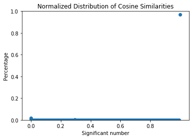
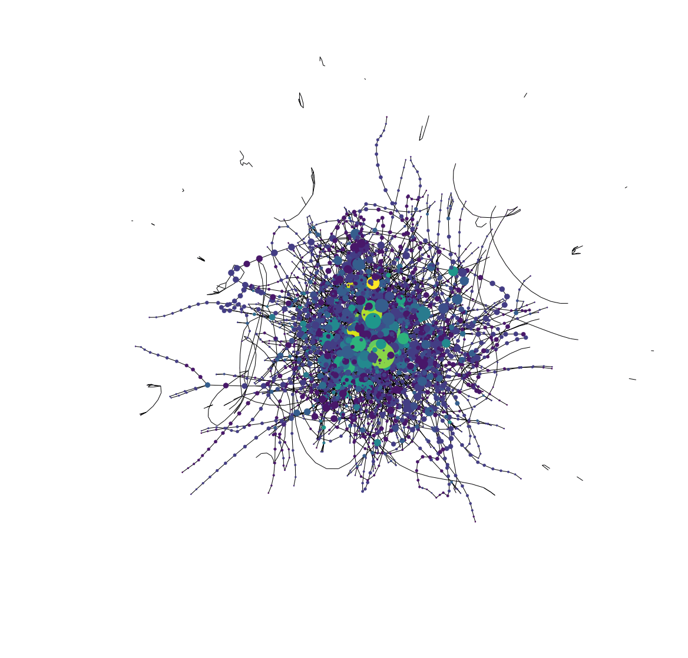
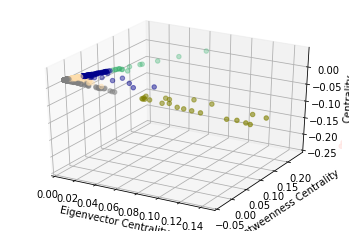
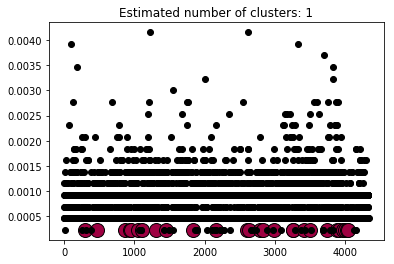

# Creating IP-based Profiles for Document Recommendation on EDGAR

### Project Description & Motivation

EDGAR log file set has a wealth of information about (masked) IP addresses and which documents the ip address attempted to access. This project aims to create a log of similar documents like a Page Rank based upon the IP paths over the course of a day. 

The applicability of the model could serve investigators looking into possible networks amongst anonymous IP addresses. It could also possibly detect latent social networks or grouped similar behavior. 

### Background

EDGAR is the Securities and Exchange Commission's database for accessing publicly available financial & ownership information about publicly traded companies. Millions of people across the world access the database, including crawlers from large institutions like Bloomberg and smaller investors.

### Github Structure
* data: contains the sample log data.
* worksheet: contains the Jupyter Notebooks.
* scripts: contains the scripts used in ETL.
* img: will contain the graph images to be used on the README.

### Exploratory Data Analysis

#### Assumptions

1. All events are independent; each event represents a unique identifiable sequence per IP address.
2. Crawlers used are represented in the higher range of document acquisition.
3. Smaller financial researchers can be represented by the range of document hits 30 - 200 and with ip hits in the range of 30 - 200. 

#### The Source: EDGAR Log File Dataset
Source: https://www.sec.gov/dera/data/edgar-log-file-data-set.html

To obtain the data, go to the above site and download the log file for Log for '10 OCT 2010', log20101010.zip.

#### Features of the Dataset

Total Attributes: 16
Key Features: ip, date, time, accession
Feature Engineered: datetime, ip_ccount, doc_ccount, ip_total_count, doc_total_count, toDoc

#### Basic Log & Sample Numbers

Events: 2,136,342
Sample Size: 16,413

Documents in Original: 959,850
Documents in Sample: 4,361

IPs in Original: 14,277
IPs in Sample: 231

#### Network Features

Type: Graph
Number of nodes: 4333
Number of edges: 7929
Average degree:   3.6598

### Pipeline

*Extract*
* Uploaded log files to S3 bucket.
* Read log file into a Pandas DataFrame.

*Transform*
* Reformatted date columns & dropped unused attributes
* Featured engineered columns for filtering events by number of number of total hits by ip and number of total hits per document (accession). 
* Feature engineered the toDoc column in order to obtain a path of from the document to the next document.

*Load*
* Loaded the document into NetworkX graphing to visualize the network and obtain degrees of centrality and betweenness.

### Modelling & Evaluation

#### First Approach: Collaborative Filtering: Model-Based, User to User (IP to IP) with Cosine Similarity 

**FAILED**

My first attempt to create a recommender through profiles was a model-based Collaborative Filtering User to User approach using cosine similarity.  The idea was to create vectors of the most highly visited sites for each IP address.  However, nearly 100% of the cosine similarities between the path ways for the most popular documents were perfectly aligned.  In the above Scatter Plot of the distribution of cosine to a normalized count for that cosine reveals that a significant majority are very similar, too similar in fact to distinguish behavioral patterns. 3,426,201 paths were analysed. In short, you can't recommend something when both users saw exactly the same things; there's nothing to recommend.

The script can be found here: [scripts/collab_filter_u2u.py]

#### Second Approach: SVD User-Item Collaborative Filtering

*to be filled in*

#### Third Approach: Network Analysis, using Document Centralities (Betweenness/Degree of Centrality/Eigenvector Centrality)

##### Part i: Overview of the Network
Like a good soldier, this data scientist does not give up (that easily at the least). Finding similarities model-approaches was difficult, but what if the information could be analyzed through the lens of network analysis.  Below is a graphical representation of the network for the presumably smaller financial research groups or individuals.  The parameters on document hits were set between 30 and 200, and IP address counts set between the same numbers to produce the graph of 4,333 documents. 

Type: Graph
Number of nodes: 4333
Number of edges: 7929
Average degree:   3.6598

##### Part A: in KM Clustering 

**KM Clustering - 3D Representation of the Eigenvector Centrality/Betweenness Centrality/Centrality**

Much like the virus graph above, the information here does not appear to have more than cluster despite the attempt to break it into 5.

##### Part B: with Autoencoding 

##### Part C: DBSCAN

Also in the DBSCAN, we can see no correlation to clustering. 

**DBSCAN & Clustering Metric Scores**

SKlearn Metrics provide further proof that the data in its current state does not support creating an accurate recommender since the data cannot be clustered.

| Metric | Score | 
| -------|------ |
|Estimated number of clusters | 1 | 
|Estimated number of noise points| 4306 |
|Homogeneity| 0.005 |
|Completeness| 1.000 |
|V-measure| 0.009 |
|Adjusted Rand Index| 0.000 |
|Adjusted Mutual Information| -0.000 |
|Silhouette Coefficient| 0.009 |

### Conclusion & Further Steps

